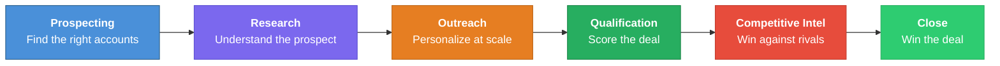
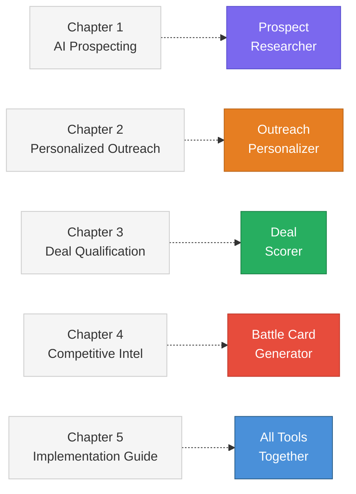

<div align="center">


# AI Sales Playbook

### A ready-to-use strategy guide and toolkit for bringing AI into your sales workflow

*No coding experience required to read the playbook. No API keys required to run the tools.*

[Read the Playbook](playbook/README.md) · [Try the Tools](#-the-4-tools) · [See Sample Output](#-sample-deal-score)

</div>

---

## What This Does

This project answers one question: **"How do I actually use AI to sell better?"**

It includes two things:

1. **A 5-chapter strategic playbook** that walks you through using AI at every stage of the sales cycle — from finding prospects to closing deals
2. **4 working Python tools** you can run right now to see AI-assisted sales in action

Everything works out of the box. The tools run in **mock mode** by default, meaning you can explore every feature without signing up for anything or entering an API key.

---

## How It All Fits Together

Every tool maps to a specific stage of the sales cycle, and every playbook chapter teaches you the strategy behind it:





---

## The 4 Tools

Each tool handles a different part of the sales workflow. All four run in mock mode by default — no API keys, no setup, no cost.

---

### :mag: Prospect Researcher

> **What it does:** Builds a complete research brief on any company — overview, recent news, pain points, tech stack, key contacts, and recommended approach angles.

| | |
|---|---|
| **Input** | A company name (e.g., `"Snap Inc"`) |
| **Output** | A structured research brief with talking points |
| **Mock data** | Pre-built briefs for Snap Inc and HubSpot; generates plausible briefs for any other company |
| **Why it matters** | Cuts prospect research time from 45 minutes to 5 minutes |

```bash
python run_tools.py research "Snap Inc"
```

---

### :envelope: Outreach Personalizer

> **What it does:** Takes prospect research and combines it with outreach templates to produce personalized emails scored on specificity, personalization depth, CTA clarity, and tone.

| | |
|---|---|
| **Input** | A prospect name + template type (`cold_intro`, `warm_referral`, `event_followup`, `renewal`, `upsell`) |
| **Output** | A personalized email draft with quality scores |
| **Mock data** | Works with any prospect; uses researcher output for personalization |
| **Why it matters** | Level 3 personalization at Level 1 speed — every email feels hand-written |

```bash
python run_tools.py personalize --prospect "Snap Inc" --template cold_intro
```

---

### :chart_with_upwards_trend: Deal Scorer

> **What it does:** Analyzes free-text deal notes and extracts BANT signals (Budget, Authority, Need, Timeline) to produce a qualification score from 0-100.

| | |
|---|---|
| **Input** | Deal notes from your CRM, call summaries, or email threads |
| **Output** | A score card with BANT breakdown, risk signals, and recommended next actions |
| **How it works** | **Deterministic regex analysis** — no AI/LLM needed. Fast, free, transparent, fully offline |
| **Why it matters** | Turns subjective "gut feel" pipeline reviews into data-driven qualification |

```bash
python run_tools.py score --notes "Met with VP Marketing, budget of $150K approved, Q3 pilot"
```

---

### :crossed_swords: Battle Card Generator

> **What it does:** Produces competitive battle cards with strengths, weaknesses, differentiators, objection handling scripts, trap questions, and landmine responses.

| | |
|---|---|
| **Input** | A competitor name (e.g., `"Google Ads"`) |
| **Output** | A structured battle card ready for your sales team |
| **Mock data** | Pre-built cards for Google Ads and Outreach.io; generates plausible cards for any competitor |
| **Why it matters** | Your reps walk into every competitive deal with a prepared playbook |

```bash
python run_tools.py battlecard --competitor "Google Ads"
```

---

## The 5 Playbook Chapters

The [full playbook](playbook/README.md) is a strategic guide you can read without touching any code.

| # | Chapter | What You'll Learn |
|---|---------|-------------------|
| 1 | **AI-Augmented Prospecting** | How to reduce prospect research time by 80-90% with structured prompts |
| 2 | **Personalized Outreach at Scale** | How to send deeply personalized emails to hundreds of prospects, with an A/B testing framework |
| 3 | **Deal Qualification & Scoring** | How to replace gut-feel pipeline reviews with BANT scoring and NLP pattern matching |
| 4 | **Competitive Intelligence** | How to generate battle cards, run win/loss analysis, and monitor competitors automatically |
| 5 | **Implementation Guide** | A 90-day rollout plan with tool selection, privacy framework, and ROI measurement |

---

## Sample Deal Score

Here is real output from the Deal Scorer tool, given the input: *"Met with VP Marketing, budget of $150K approved, interested in Q3 pilot"*

```
Deal Qualification Score
========================

Overall: 45/100 (D) — Needs Work

 Dimension   | Score | Max
-------------|-------|-----
 Budget      |  24   |  25    "budget of $150K approved"
 Authority   |   7   |  25    "VP Marketing" (but who signs?)
 Need        |   7   |  25    "pilot" mentioned (but pain unclear)
 Timeline    |   7   |  25    "Q3" referenced (but no driving event)

Recommended Next Actions:
 1. Map the buying committee — identify the economic buyer
 2. Deepen discovery — quantify the business impact of the problem
 3. Establish timeline — ask about driving events that create urgency
```

> **What this tells you:** Budget is strong (24/25) but the deal is weak everywhere else. The scorer flags exactly where to focus your next conversation — no guesswork required.

---

## Getting Started

### Option 1: Streamlit App (visual, recommended for demos)

```bash
pip install -r requirements.txt
./run.sh
```

Opens at `http://localhost:8501` with four interactive tabs — one per tool.

### Option 2: Command Line

```bash
# Prospect research
python run_tools.py research "Snap Inc"

# Personalized outreach
python run_tools.py personalize --prospect "HubSpot" --template warm_referral

# Deal qualification scoring
python run_tools.py score --notes "Budget confirmed at $200K, CEO involved, launch by Q4"

# Competitive battle cards
python run_tools.py battlecard --competitor "Google Ads"
```

### Option 3: Live Mode (with an API key)

All tools support live mode using any OpenAI-compatible API:

```bash
export OPENAI_API_KEY="sk-..."
python run_tools.py research "Salesforce" --mode live
```

Works with OpenAI, Anthropic (via proxy), Azure OpenAI, Ollama, and more.

---

## Why This Matters

This is not a concept deck or a research paper. It is a **working system** — a documented playbook with running tools that a sales team can adopt today.

| What | Why |
|------|-----|
| **Mock mode by default** | Stakeholders can evaluate the system without any setup or cost |
| **Deterministic scoring** | The Deal Scorer uses regex, not AI — fast, free, transparent, reproducible |
| **Structured output** | Every tool produces data that integrates with CRM workflows |
| **Minimal dependencies** | Zero external dependencies in mock mode; only Streamlit for the web demo |
| **Live mode ready** | Flip a switch to connect to any OpenAI-compatible API for production use |

---

## About the Author

**CJ Fleming** — 15+ years in media sales leadership, Columbia AI certification.

This project is the bridge between operational sales expertise and the AI-enabled future of revenue organizations. The playbook reflects how pipeline reviews actually work, what makes outreach convert, and how to roll out new tools without disrupting a sales team's rhythm. The tools prove that AI enablement is not theoretical — it is working code you can run today.

<div align="center">

[LinkedIn](https://linkedin.com) · [Read the Full Playbook](playbook/README.md)

</div>
